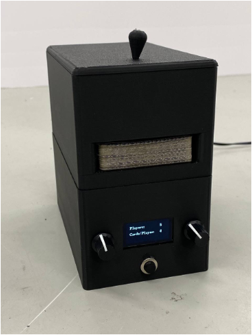
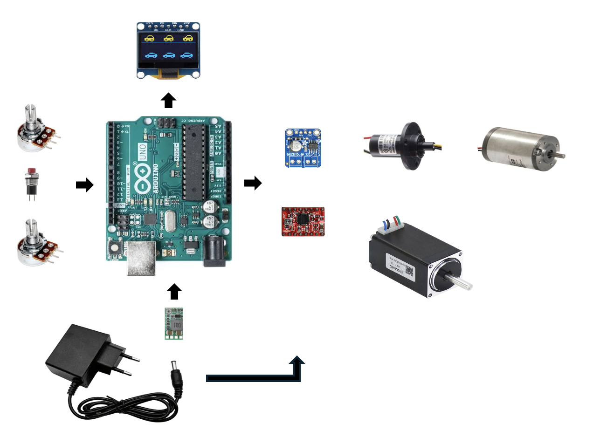

# Automated Card Dealer 
- [Poster (PDF)](Card-dealer-poster.pdf)
  

  

This project was developed as part of the course **KON-C3003 – Mekatroniikan harjoitustyö (5 ECTS)**.  
I was responsible for **electronics design** and served as the **team leader**.  

The system automates card distribution using an **Arduino Uno**:  
- A **DC motor** dispenses cards.  
- A **stepper motor** rotates to position them accurately.  
- Users set **player count** and **card count** via **potentiometers**, displayed on an **OLED screen**.  
- Dealing starts with a **push button**.  
---

## 🛠 Mechanics  
- Hinge  
- Timing Belt  
- Pulleys  
- Lazy Susan  

---

## ⚡ Electronics  
- Arduino Uno  
- 2 × Potentiometers  
- Push Button  
- 12 V Power Supply  
- Slip Ring  
- DC Motor  
- Stepper Motor  
- DRV8871 DC Motor Driver  
- A4988 Stepper Driver  
- D24V5F5 Voltage Regulator  
- SSD1306 OLED Screen  

  

- [Electronics KiCad (PDF)](Card-dealer-circuit_reall.pdf)  
---

## 💻 Code  
- [card_dealer_code (PDF)](arduino_code_for_card_dealer.pdf)  

---

## 🖤 3D-Modeled Parts  
- `dealer-roof.par`  
- `dealer-roll.par`  
- `dealer-top.par`  
- `dealer-middle-ring.prt`  
- `dealer-bottom.prt`
  
- [card_dealer_3D-parts (PDF)](dealer-parts.pdf)
---

## 🔨 Building Process  
1. **Rough Sketching** – Initial concept drawings and brainstorming ideas.  
2. **Prototyping Mechanisms** – Testing different mechanical approaches on a small scale.  
3. **Full-Scale Prototype** – Developing a functional prototype for testing.  
4. **Final Product** – Refining and completing the final version based on results.  

---

## 💡 Discussion & Future Improvements  
The card dealer successfully achieved the desired functionality. Throughout the project, we gained valuable insights into designing and refining simple mechatronic systems.  

**Future improvements could include:**  
- Designing a **custom PCB** for better integration and reliability.  
- Creating **modular parts and code** for easier updates.  
- Adding an **On/Off switch or fuse** for safety.  
- Using **bolts/screws instead of glue** for durability.  
- Implementing a **cooling system** to prevent overheating.  
- Refining the **mechanical design** for smoother operation.  

---

## 👥 Team Members  
- Petteri Suonpää  
- Elmo Laine  
- Albert Vauhkonen  

---

